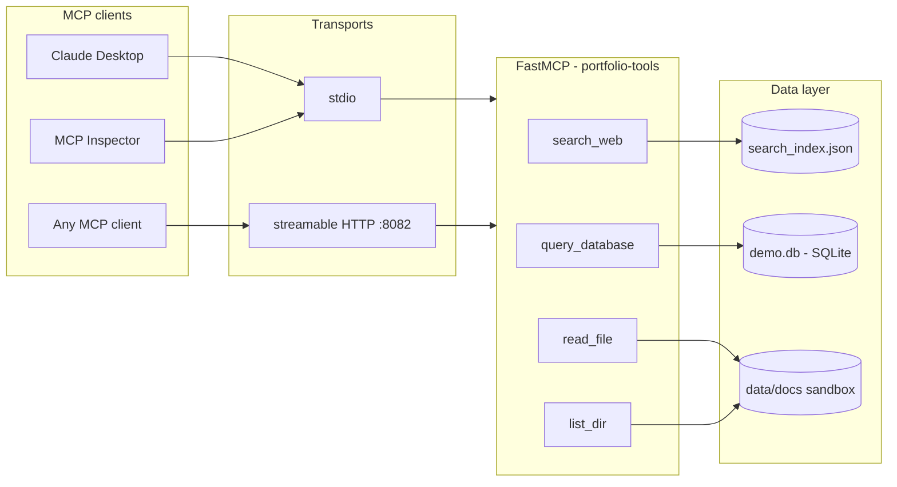

# mcp-tools-server

A Model Context Protocol (MCP) server in Python, built on the official
[`mcp` SDK](https://github.com/modelcontextprotocol/python-sdk) (FastMCP):
four production-shaped tools, dual transport (stdio + streamable HTTP),
explicit security hardening and a fully offline test suite.

> **Portfolio demo project** by [Anton Zhuravlev](https://github.com/INTERpol21) —
> one of four repositories in an AI-platform portfolio. It is intentionally
> small, but every decision (layering, security, tests) is production-style.

## What this demonstrates

- **MCP protocol servers** with the official Python SDK: tools, schemas,
  lifecycle, `stdio` and `streamable-http` transports from one codebase.
- **Tool design for LLMs.** Tool names, argument schemas and docstring
  descriptions are the *interface the model reasons over* — they decide
  whether the right tool gets called. Descriptions here carry the DB schema,
  examples and constraints on purpose.
- **Security hardening**: SQL restricted to read-only via a SQLite
  *authorizer* (not regex guessing), multi-statement injection rejection,
  a filesystem sandbox built on `resolve()` + `is_relative_to`, size caps.
- **Clean layering**: all tool logic is pure typed functions in
  `app/tools/` with zero MCP imports; `app/server.py` registers thin
  wrappers. Tests exercise the logic directly and stay independent of SDK
  internals.

## Architecture



## Tools

| Tool | Arguments | Returns |
| --- | --- | --- |
| `search_web` | `query: str`, `max_results: int = 5` | ranked `{title, url, snippet, score}` results from a curated offline index |
| `query_database` | `sql: str`, `max_rows: int = 50` | `{columns, rows, row_count, truncated}` — single SELECT over the demo SQLite DB |
| `read_file` | `path: str` | `{path, size_bytes, content}` — UTF-8 text inside the data sandbox (100 KB cap) |
| `list_dir` | `path: str = "."` | `{path, entries: [{name, type, size_bytes}], count}` — sorted, directories first |

Example call (any MCP client):

```json
{
  "name": "query_database",
  "arguments": {
    "sql": "SELECT c.name, v.title, v.salary_rub FROM vacancies v JOIN companies c ON c.id = v.company_id WHERE v.grade = 'senior' ORDER BY v.salary_rub DESC"
  }
}
```

Demo database schema (seeded automatically on first query, ~25 rows of
IT job-market data): `companies(id, name, industry, city)`,
`vacancies(id, company_id, title, grade, salary_rub, stack)`,
`applications(id, vacancy_id, applied_at, status)`.

> **Honest note:** `search_web` is an *offline stub* — it ranks 14 curated
> entries by keyword overlap, so demos and tests are deterministic, free and
> network-independent. In production you would swap the implementation for a
> real search API (Tavily, Brave, SerpAPI); the tool contract stays identical.

## Quickstart

```bash
git clone https://github.com/INTERpol21/mcp-tools-server.git
cd mcp-tools-server
python -m venv .venv && source .venv/bin/activate
make install            # pip install -r requirements.txt

make run-stdio          # stdio transport (default) - for local MCP clients
make run-http           # streamable HTTP on 0.0.0.0:8082 (endpoint: /mcp)
make seed               # optional: pre-generate data/demo.db
```

Or with Docker (streamable HTTP on port 8082):

```bash
docker compose up --build
```

## Transports

| Mode | Command | Notes |
| --- | --- | --- |
| stdio (default) | `python -m app.server` | for clients that spawn the server as a subprocess (Claude Desktop, Inspector) |
| streamable HTTP | `python -m app.server --transport http` | serves `http://localhost:8082/mcp`; falls back to legacy SSE automatically if the installed SDK predates streamable HTTP |

## Claude Desktop integration

Add to `claude_desktop_config.json`
(macOS: `~/Library/Application Support/Claude/claude_desktop_config.json`,
Windows: `%APPDATA%\Claude\claude_desktop_config.json`):

```json
{
  "mcpServers": {
    "portfolio-tools": {
      "command": "python",
      "args": ["-m", "app.server", "--transport", "stdio"],
      "env": {
        "PYTHONPATH": "/absolute/path/to/mcp-tools-server",
        "DATA_DIR": "/absolute/path/to/mcp-tools-server/data"
      }
    }
  }
}
```

Notes:

- Claude Desktop does **not** set a working directory for servers, so
  `PYTHONPATH` must point at the repo root for `-m app.server` to resolve
  (and `DATA_DIR` should be absolute for the same reason).
- If dependencies live in a virtualenv, use its interpreter as `command`,
  e.g. `/absolute/path/to/mcp-tools-server/.venv/bin/python`.
- Restart Claude Desktop after editing; the four tools appear in the
  tools menu of a new chat.

### Debugging with MCP Inspector

```bash
npx @modelcontextprotocol/inspector python -m app.server
# or, using the SDK's dev runner (module-level `server` object is exposed):
mcp dev app/server.py
```

## Configuration

| Variable | Default | Meaning |
| --- | --- | --- |
| `DATA_DIR` | `./data` (repo-local) | sandbox root; holds `search_index.json`, `demo.db`, `docs/` |
| `MCP_PORT` | `8082` | port for the HTTP transport |
| `MCP_HOST` | `0.0.0.0` | bind address for the HTTP transport |

See `.env.example`. Variables are read from the process environment
(no dotenv dependency — export them or let compose/systemd inject them).

## Security hardening

- **`query_database`** — three independent layers:
  1. connection opened read-only (SQLite URI `mode=ro`);
  2. `sqlite3` **authorizer** allowlists `SELECT`/`READ`/`FUNCTION` and
     denies everything else — writes, DDL, `PRAGMA`, `ATTACH`,
     transactions — at statement-prepare time;
  3. multi-statement payloads (`SELECT 1; DROP ...`) rejected via
     `sqlite3.complete_statement` (a `;` inside a string literal is fine).
  Row counts are capped (default 50, hard cap 200).
- **`read_file` / `list_dir`** — every path is fully resolved (symlinks and
  `..` included) and must satisfy `resolved.is_relative_to(DATA_DIR)`;
  reads are capped at 100 KB; binary content is detected and refused.
- All failures raise a `ToolError` with a clear, single-line message —
  clients see actionable errors, never tracebacks.

## Testing

```bash
pip install pytest pytest-asyncio
make test
```

The suite is fully offline: no network, no API keys. Unit tests hit the
pure functions in `app/tools/` directly; integration tests run a real MCP
client session against the server **in memory** via the SDK's
`create_connected_server_and_client_session` helper (same one the SDK's own
test-suite uses), covering `list_tools`, a `call_tool` round-trip and
error mapping (`ToolError` -> `isError`, no tracebacks).

## Project layout

```
app/
  config.py          # env-driven settings (DATA_DIR, MCP_PORT, MCP_HOST)
  server.py          # FastMCP wiring + transport selection (stdio / http)
  tools/
    search.py        # offline search stub over the curated index
    database.py      # read-only SQL with authorizer + row caps
    files.py         # sandboxed read_file / list_dir
    seed.py          # idempotent demo.db generator
    errors.py        # ToolError (safe-to-show messages)
data/
  search_index.json  # 14 curated LLM/RAG/MCP entries
  docs/              # sample files for the file tools
tests/               # offline unit + in-memory MCP integration tests
```

## License

MIT — see [LICENSE](LICENSE).

---

*Part of the **AI Platform Portfolio** by [Anton Zhuravlev](https://github.com/INTERpol21):
[llm-gateway](https://github.com/INTERpol21/llm-gateway) ·
[rag-pgvector](https://github.com/INTERpol21/rag-pgvector) ·
**mcp-tools-server** ·
[agent-orchestrator](https://github.com/INTERpol21/agent-orchestrator).
The [agent-orchestrator](https://github.com/INTERpol21/agent-orchestrator) consumes this
server's `search_web` tool over streamable HTTP as the "web" leg of its research loop.*
