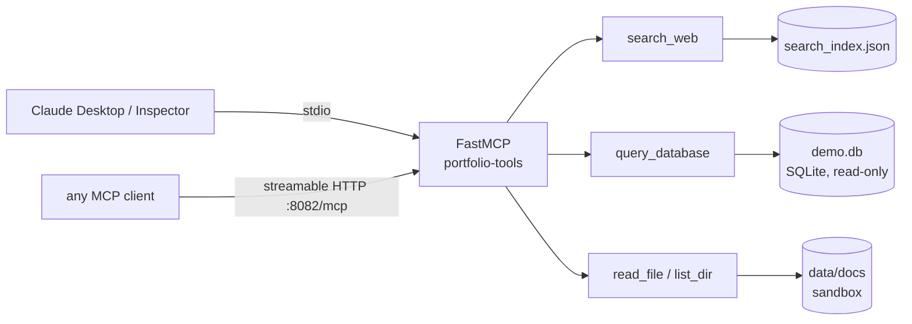

# mcp-tools-server


MCP server on the official Python SDK (FastMCP): four tools, stdio and streamable HTTP transports from one codebase, read-only SQL, a filesystem sandbox, offline test suite.

## What this demonstrates

- MCP servers with the official SDK: tools, resources, schemas, lifecycle, both transports.
- Tool design for LLMs: names, argument schemas and docstrings are the interface the model reasons over, so descriptions carry the DB schema, examples and constraints on purpose.
- Least-privilege security controls: SQL locked to read-only via a SQLite authorizer rather than regex filtering (plus multi-statement injection rejection), and a filesystem sandbox built on `resolve()` + `is_relative_to`, with size caps and binary detection.
- Structured JSON logging to stderr: every tool call, rejection and startup is one machine-parseable line, shapes and sizes only — never SQL text, rows or file contents.
- Layering: tool logic is pure typed functions in `app/tools/` with zero MCP imports; `app/server.py` registers thin wrappers.

## Architecture



## Tools

| Tool | Arguments | Returns |
|---|---|---|
| `search_web` | `query`, `max_results=5` | ranked `{title, url, snippet, score}` from an offline curated index |
| `query_database` | `sql`, `max_rows=50` | `{columns, rows, row_count, truncated}` — single SELECT over the demo DB |
| `read_file` | `path` | UTF-8 file content inside the sandbox, 100 KB cap |
| `list_dir` | `path="."` | sorted entries with type and size |

All four tools declare TypedDict results, so responses ship as machine-readable `structuredContent` (with an output schema) alongside the usual JSON text.
The files in `data/docs/` are also published as MCP resources — concrete `docs://<file>` entries plus a `docs://{name}` template; resource reads go through `read_file`'s sandbox and size cap.

Demo DB (seeded on first query, ~25 rows of job-market data): `companies(id, name, industry, city)`, `vacancies(id, company_id, title, grade, salary_rub, stack)`, `applications(id, vacancy_id, applied_at, status)`.

## Quickstart

```bash
make install
make run-stdio      # stdio (default), for clients that spawn the server
make run-http       # streamable HTTP on :8082/mcp
# or: docker compose up --build
```

Debugging: `npx @modelcontextprotocol/inspector python -m app.server`.

## Claude Desktop

Add to `claude_desktop_config.json` (macOS: `~/Library/Application Support/Claude/`, Windows: `%APPDATA%\Claude\`), restart, and the four tools appear in a new chat:

```json
{
  "mcpServers": {
    "portfolio-tools": {
      "command": "python",
      "args": ["-m", "app.server", "--transport", "stdio"],
      "env": {
        "PYTHONPATH": "/absolute/path/to/mcp-tools-server",
        "DATA_DIR": "/absolute/path/to/mcp-tools-server/data"
      }
    }
  }
}
```

Claude Desktop sets no working directory for servers, so both paths must be absolute; if deps live in a venv, use its interpreter as `command`.

## Configuration

Read from the process environment, no dotenv (see `.env.example`): `DATA_DIR` — sandbox root holding `search_index.json`, `demo.db` and `docs/` (default `./data`); `MCP_HOST` / `MCP_PORT` — HTTP transport bind (default `0.0.0.0:8082`).

## Notes

- `search_web` is an offline stub: keyword ranking over 14 curated entries, so demos and tests are deterministic. A real search API drops in behind the same contract.
- `query_database` layers, least-privilege: read-only URI (`mode=ro`), a `sqlite3` authorizer that allowlists SELECT/READ/FUNCTION and denies writes, DDL, PRAGMA, ATTACH and transactions, `complete_statement` rejection of `SELECT 1; DROP ...` payloads, and row/cell/result-size caps.
- `read_file` / `list_dir` are sandboxed to `DATA_DIR`: absolute paths are accepted only when they resolve inside the root; any escape (`..`, outside path, or symlink target) is denied.
- Structured JSON logging (`app/core/logging.py`) writes one JSON object per line to **stderr** (stdout carries the stdio JSON-RPC frames), logging only call shapes/sizes/paths — never data.
- All failures raise `ToolError` with a single-line message — clients see actionable errors, never tracebacks.

## Testing

97 tests, offline: units hit the pure functions directly; integration runs a real MCP client against the server in memory via the SDK's `create_connected_server_and_client_session` — tools, structured output, resources and error mapping included.
`make install-dev && make test`; `make lint` for ruff, `make typecheck` for strict mypy. CI runs lint + strict mypy + tests, a security job (pip-audit + bandit), and CodeQL; Dependabot keeps deps current. The seeded `data/` (demo.db, docs/, search_index.json) is resolved from the repo root by default; set `DATA_DIR` to relocate the sandbox.

---

MIT. Portfolio demo — siblings: [llm-gateway](https://github.com/INTERpol21/llm-gateway) · [rag-pgvector](https://github.com/INTERpol21/rag-pgvector) · [agent-orchestrator](https://github.com/INTERpol21/agent-orchestrator), which calls this server's `search_web` over HTTP.

## Releases

Version history is in [CHANGELOG.md](CHANGELOG.md).
